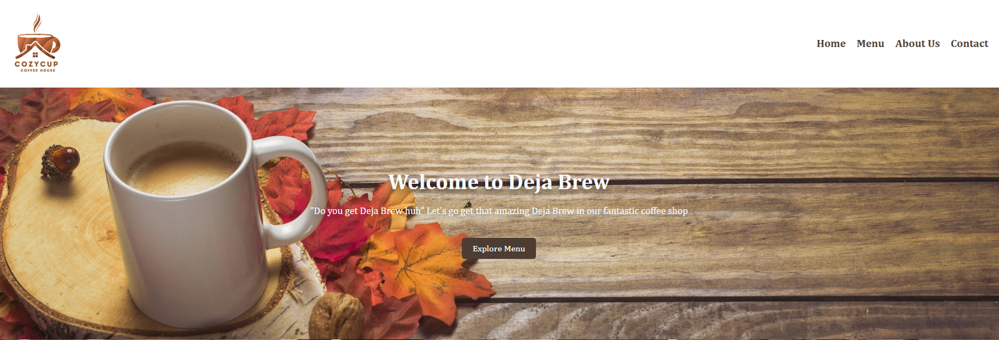
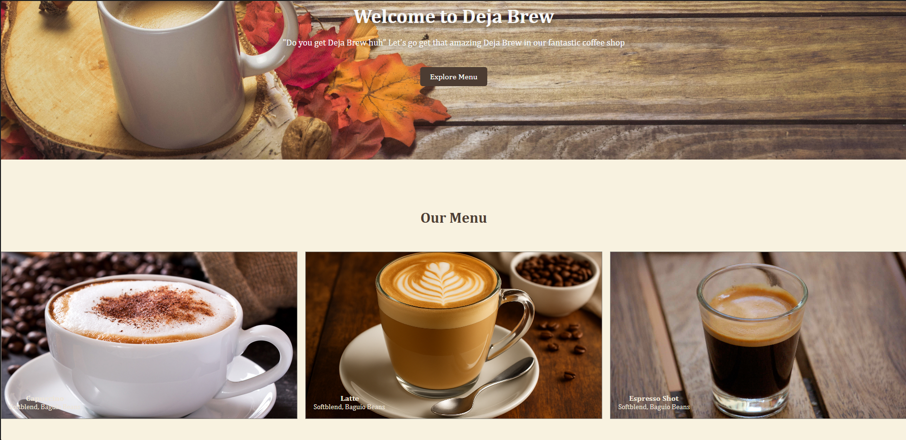
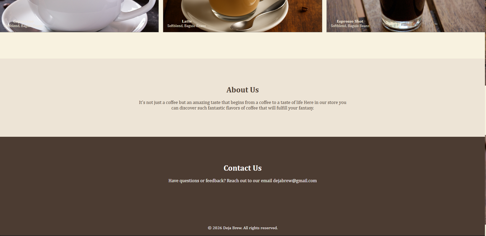

# Project Description
In this repository, We were given a task to revert and add our own ideas for a Coffee Shop Website, 
originally named "Cozy-cup Cafe". 

We decided to separate the task of revising and filling up all the necessary sections for each parts of the HTML.
We started on creating separate branches for each member of our pair to organize our code better, 
and would later merge them into main branch once the changes are finalized.

## Features
- Changed the project name from CozyCup Cafe to "Deja Brew" in the hero-section
- Changed hero-section's short description
- Added background image in the hero-section and adjusted css styles
- Added a gallery type with small css interaction for menu-section
- Changed the aboutUs-section description with a small description of our desired coffee shop
- Changed the contactUs-section with our personal links
- Added slight changes in website proportions, sizing, and etc.

## Screen Captures

## About Authors
BS - Computer Science 3 - Application Development

Plural, Keziah Zoe

Balofiños, Jane Pauline

